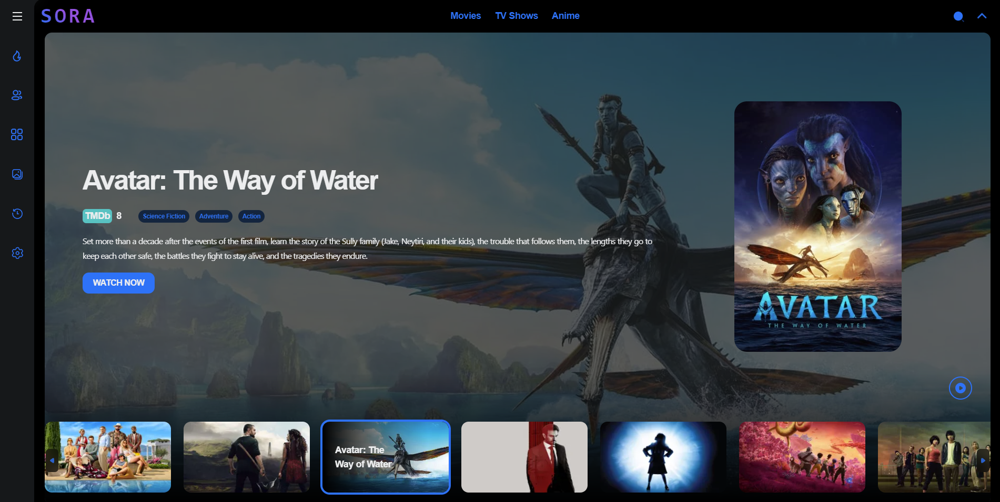

<a name="readme-top"></a>

<!-- PROJECT LOGO -->
<br />
<div align="center">
  <a href="https://github.com/Khanhtran47/remix-movie">
    
  </a>

<h3 align="center">Remix Movie</h3>

  <p align="center">
    A website for streaming movies without ads created by Remix and NextUI.
    <br />
    <a href="https://github.com/Khanhtran47/remix-movie"><strong>Explore the docs »</strong></a>
    <br />
    <br />
    <a href="https://sora-movies.vercel.app/">View Demo</a>
    ·
    <a href="https://github.com/Khanhtran47/remix-movie/issues">Report Bug</a>
    ·
    <a href="https://github.com/Khanhtran47/remix-movie/issues">Request Feature</a>
  </p>
</div>

<!-- TABLE OF CONTENTS -->
<details>
  <summary>Table of Contents</summary>
  <ol>
    <li><a href="#tech-stack">Tech Stack</a></li>
    <li>
      <a href="#getting-started">Getting Started</a>
      <ul>
        <li><a href="#installation">Installation</a></li>
      </ul>
    </li>
    <li><a href="#roadmap">Roadmap</a></li>
    <li><a href="#contributing">Contributing</a></li>
    <li><a href="#license">License</a></li>
  </ol>
</details>

<div align="center">
  <a href="https://github.com/Khanhtran47/remix-movie">
    
  </a>
</div>

<!-- TECH STACK -->

## Tech Stack

- Remix
- NextUI
- TailwindCSS
- SwiperJS
- Framer Motion
- ...

<p align="right">(<a href="#readme-top">back to top</a>)</p>

<!-- GETTING STARTED -->

## Getting Started

This is an example of how you may give instructions on setting up your project locally.
To get a local copy up and running follow these simple example steps.

### Installation

1. Clone the repo

```bash
git clone https://github.com/Khanhtran47/remix-movie
```

2. Install dependencies

```bash
yarn install
```

3. Start the server

```bash
yarn dev
```

<p align="right">(<a href="#readme-top">back to top</a>)</p>

<!-- ROADMAP -->

## Roadmap

See the [open issues](https://github.com/Khanhtran47/remix-movie/issues) for a full list of proposed features (and known issues).

<p align="right">(<a href="#readme-top">back to top</a>)</p>

## Contributing

Contributions are what make the open source community such an amazing place to learn, inspire, and create. Any contributions you make are **greatly appreciated**.

If you have a suggestion that would make this better, please fork the repo and create a pull request. You can also simply open an issue with the tag "feature".
Don't forget to give the project a star! Thanks again!

1. Fork the Project
2. Create your Feature Branch (`git checkout -b feature/AmazingFeature`)
3. Commit your Changes (`git commit -m 'Add some AmazingFeature'`)
4. Push to the Branch (`git push origin feature/AmazingFeature`)
5. Open a Pull Request

<!-- LICENSE -->

## License

Distributed under the MIT License. See `LICENSE.txt` for more information.

<p align="right">(<a href="#readme-top">back to top</a>)</p>
