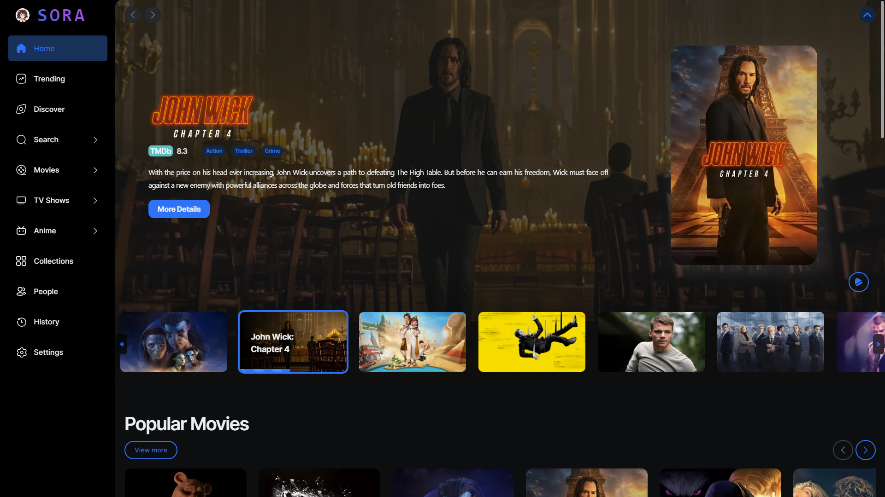

<a name="readme-top"></a>

<!-- PROJECT LOGO -->
<br />
<div align="center">
  <a href="https://github.com/Khanhtran47/remix-movie">
    
  </a>

<h2 align="center">SORA</h2>
  <p align="center">
    A web app for exploring, watching movies, tv shows and anime built with Remix and NextUI.
    <br />
  </p>
</div>

> **Warning**
> This app is a work in progress.
> <br/>

<!-- TABLE OF CONTENTS -->
<details>
  <summary>Table of Contents</summary>
  <ol>
    <li><a href="#tech-stack">Tech Stack</a></li>
    <li><a href="#development">Development</a></li>
    <li><a href="#license">License</a></li>
  </ol>
</details>
<br/>

<div align="center">
  <a href="https://github.com/Khanhtran47/remix-movie">
    
  </a>
</div>
<br/>

<!-- TECH STACK -->

## Tech Stack

- **Remix** with Typescript
- **NextUI** for pre-made components and themes
- Styled using **TailwindCSS** and **Stitches**
- **SwiperJS** for touch slider
- Internationalization using **i18n**
- Authentication, database using **Supabase**
- UI Components built using **Radix UI**
- Animation using **Framer Motion**
- State management using **Zustand**
- Custom media player using **Artplayer**
- Cache using **LRU Cache**
- Color manipulation and conversion using **Tinycolor**

<p align="right">(<a href="#readme-top">back to top</a>)</p>

<!-- DEVELOPMENT -->

## Development

<br/>

1. Install dependencies using pnpm

```sh
pnpm install
```

2. Copy `.env-example` and update the variables

3. Start the development server

```sh
pnpm dev
```

<p align="right">(<a href="#readme-top">back to top</a>)</p>

<!-- LICENSE -->

## License

Distributed under the MIT License. See [LICENSE.txt](https://github.com/Khanhtran47/Sora/blob/master/LICENSE.txt) for more information.

<p align="right">(<a href="#readme-top">back to top</a>)</p>
